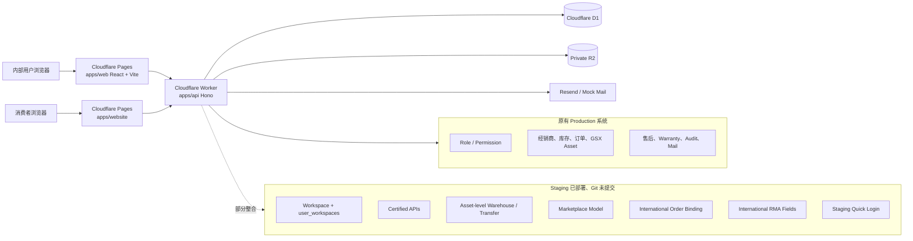
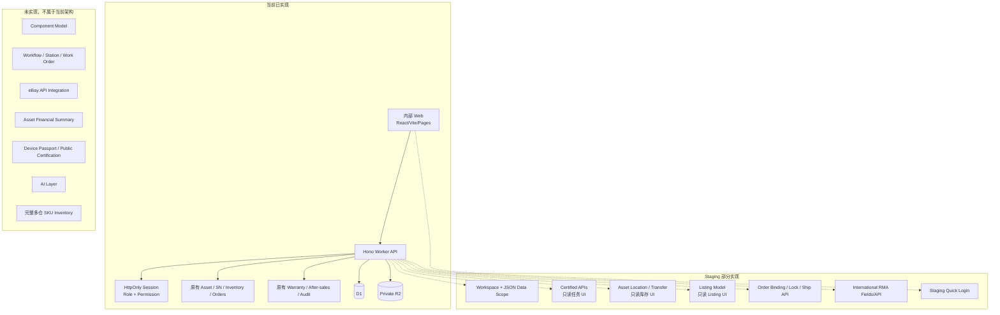

# MaxCINE 当前真实技术与业务盘点

审计时间：2026-10-03  
审计方式：仅只读检查代码、Git、Cloudflare Worker/Pages、Staging/Production D1、Staging R2 与既有测试结果。  
本次没有修改代码、执行 Migration、部署、清理 Git 或修复问题。

一个重要前提：本次提供的当前目录是空目录，不是 Git 仓库。实际 MaxCINE 仓库位于：

[MaxCINE repository](/Users/rog/Documents/Codex/2026-07-26/maxcine-github-maxcine-maxcine-cn-maxcine)

---

## 1. 当前工作区状态

### Git

- 当前分支：`codex/website-liquid-glass-rework`
- 当前 HEAD：`20a2c9624260a1c153a641a56cddfeab2359b9a8`
- `main` / `origin/main`：`fa04162`
- 最近已提交内容主要是官网和 Warranty 页面改动。
- International Certified Phase 1 没有对应 Git commit。
- Phase 1 代码和 Migration 目前全部是未提交工作区内容。

### International Phase 1 已修改文件

- [apps/api/src/auth.ts](/Users/rog/Documents/Codex/2026-07-26/maxcine-github-maxcine-maxcine-cn-maxcine/apps/api/src/auth.ts)
- [apps/api/src/index.ts](/Users/rog/Documents/Codex/2026-07-26/maxcine-github-maxcine-maxcine-cn-maxcine/apps/api/src/index.ts)
- [apps/api/src/types.ts](/Users/rog/Documents/Codex/2026-07-26/maxcine-github-maxcine-maxcine-cn-maxcine/apps/api/src/types.ts)
- [apps/api/wrangler.toml](/Users/rog/Documents/Codex/2026-07-26/maxcine-github-maxcine-maxcine-cn-maxcine/apps/api/wrangler.toml)
- [apps/web/src/App.tsx](/Users/rog/Documents/Codex/2026-07-26/maxcine-github-maxcine-maxcine-cn-maxcine/apps/web/src/App.tsx)
- [apps/web/src/OperationsPortal.tsx](/Users/rog/Documents/Codex/2026-07-26/maxcine-github-maxcine-maxcine-cn-maxcine/apps/web/src/OperationsPortal.tsx)
- [apps/web/src/design-system.css](/Users/rog/Documents/Codex/2026-07-26/maxcine-github-maxcine-maxcine-cn-maxcine/apps/web/src/design-system.css)
- [apps/web/src/systemNavigation.tsx](/Users/rog/Documents/Codex/2026-07-26/maxcine-github-maxcine-maxcine-cn-maxcine/apps/web/src/systemNavigation.tsx)
- [packages/shared/src/types.ts](/Users/rog/Documents/Codex/2026-07-26/maxcine-github-maxcine-maxcine-cn-maxcine/packages/shared/src/types.ts)

### International Phase 1 未跟踪文件

- [0028_international_certified_v1.sql](/Users/rog/Documents/Codex/2026-07-26/maxcine-github-maxcine-maxcine-cn-maxcine/apps/api/migrations/0028_international_certified_v1.sql)
- [0029_warehouse_workspace.sql](/Users/rog/Documents/Codex/2026-07-26/maxcine-github-maxcine-maxcine-cn-maxcine/apps/api/migrations/0029_warehouse_workspace.sql)
- [InternationalPortal.tsx](/Users/rog/Documents/Codex/2026-07-26/maxcine-github-maxcine-maxcine-cn-maxcine/apps/web/src/InternationalPortal.tsx)
- [QuickRoleLogin.tsx](/Users/rog/Documents/Codex/2026-07-26/maxcine-github-maxcine-maxcine-cn-maxcine/apps/web/src/QuickRoleLogin.tsx)
- [PHASE1_INTERNATIONAL_CERTIFIED.md](/Users/rog/Documents/Codex/2026-07-26/maxcine-github-maxcine-maxcine-cn-maxcine/docs/PHASE1_INTERNATIONAL_CERTIFIED.md)

### 无关官网改动

存在大量未提交的 `apps/website` 和 `apps/website-maintenance` 改动，包括页面、样式、产品内容、Warranty、Worker、图片及 i18n。它们与 International Phase 1 不属于同一业务范围，本次没有触碰。

### 五种状态必须分开看

| 状态 | International Phase 1 |
|---|---|
| 已写代码 | ✅ |
| 已提交 Git | ❌ |
| 已部署 Staging | ✅ |
| 已验证 Staging | ✅，但以 API/工程测试为主 |
| 已部署 Production | ❌ |

这是当前最大的交付风险：Staging 运行着未提交代码，Migration 0028/0029 也已执行但仍是本地未跟踪文件。

---

## 2. Staging 与 Production 当前部署

### Staging

- Worker：`maxcine-api-staging`
- 当前部署：`804e73f1-af74-4e51-8144-3785c5c4130d`
- Pages：`maxcine-web-staging`
- 当前部署：`1549851c-9046-49f0-8392-33c3815a24fd`
- Pages 元数据显示 source commit 为 `20a2c96`，但实际部署包包含未提交 Phase 1 工作区代码。
- D1 已应用 `0001` 至 `0029`。
- `0028` 应用时间：2026-09-30 08:27:03 UTC
- `0029` 应用时间：2026-09-30 08:59:04 UTC
- API health、Pages、测试账号、测试数据及 R2 Evidence 当前均存在。

### Production

- Worker 当前部署：`1532cc69-f875-47ef-94c9-42c49bf62fcf`
- 部署时间早于 Phase 1。
- Pages 当前部署：`c89a0809-2a20-4972-9770-ebd0a658ffc2`
- 来源：`main` 的 `fa04162`
- Production D1 只到 Migration `0025`。
- 没有 `0028`、`0029`。
- 不存在 `workspaces`、`warehouses`、`asset_inspection_tasks`、`marketplace_listings` 等 Phase 1 表。
- 不存在 Phase 1 测试账号或测试资产。

**Production 当前未部署 International Certified Phase 1。**

---

# 3. 当前总体技术架构



### 目录职责

- `apps/web`：内部系统，React 19、TypeScript、Vite、Cloudflare Pages。
- `apps/api`：Hono Cloudflare Worker；单个 `index.ts` 约 5,000 行。
- `apps/website`：公开官网、公开 Warranty 查询页面。
- `packages/shared`：共享类型、Schema、RBAC 辅助定义。
- D1：核心关系数据库，Staging 与 Production 独立。
- R2：私有 Evidence/照片对象存储。
- Mail：Production/Staging 使用 Resend，本地可使用 mock。
- Audit：使用 `audit_logs`。
- Session：HttpOnly `mc_session` Cookie，HMAC 签名，默认约 8 小时。
- Password：PBKDF2。
- 每次受保护请求重新从 D1 加载角色、权限和 Workspace Scope，不仅依赖 Cookie 内声明。
- 使用 `session_version` 支持 Session 失效。

### 阶段归属

- 原有系统：国内经销、SKU Inventory、订单、物流、GSX Asset、Warranty、售后、服务中心、RBAC、Audit、Mail。
- Phase 1：Migration 0028、Certified、Asset-level 国际仓、Listing、国际订单绑定、RMA 字段、最小 International Portal。
- 可称为 Phase 1.1 的工作区改动：Migration 0029、山东总仓 Workspace、快捷角色登录、UK 路由和 Scope 修复。代码中没有正式的 Phase 1.1 发布标记。
- Future：Component、Workflow Engine、正式 eBay API、Financial Summary、Device Passport、AI、多仓 SKU Inventory。

---

# 4. 当前数据库真实状态

## 原有核心表

确认存在：

- `users`
- `roles`
- `permissions`
- `user_roles`
- `role_permissions`
- `dealers`
- `stores`
- `service_centers`
- `products`
- `inventory`
- `inventory_transactions`
- `serial_numbers`
- `orders`
- `order_items`
- `shipments`
- `assets`
- `asset_identifiers`
- `asset_events`
- `asset_notes`
- `asset_sales`
- `after_sales_cases`
- `audit_logs`

Warranty 需要特别纠正：

- 不存在通用的 `warranties` 主表。
- Internal Warranty 主要存放在 `assets` 字段中。
- Public Warranty 使用 `asset_public_warranties` 和 entitlement 相关表。

## International Phase 1 表

| 表 | 用途和关键关系 | Staging数据 | API | 前端 |
|---|---|---:|---|---|
| `workspaces` | Workspace code、名称、默认路由 | ✅ | Context API | ✅ 导航使用 |
| `user_workspaces` | User↔Workspace；含 `data_scope_json` | ✅ | Context/Auth | ✅ |
| `asset_inspection_tasks` | Asset 检测任务、assigned_to、result、grade、final_qc | ✅ | ✅ | 🟡 只读列表 |
| `asset_inspection_evidence` | Task Evidence；R2 key/note/test data | ✅ | ✅ | ❌ 无上传 UI |
| `asset_certifications` | Asset 唯一认证；grade、状态、verification hash | ✅ | ✅ | 🟡 列表信息 |
| `warehouses` | CN-SD、SG、UK、TRANSIT | ✅ | ✅ | ✅ 只读库存 |
| `warehouse_locations` | 仓内库位 | 表存在，0 数据 | 间接支持 | ❌ |
| `asset_locations` | 每台 Asset 当前仓和状态 | ✅ | ✅ | ✅ 只读 |
| `asset_transfers` | 单机跨仓调拨 | ✅ | ✅ | ❌ |
| `sales_channels` | eBay UK 等渠道 | ✅ | 间接使用 | ❌ 独立管理页 |
| `sales_accounts` | 渠道销售账号 | ✅ | Scope/Listing 使用 | ❌ |
| `marketplace_listings` | 一机一 Listing；Asset 唯一约束 | ✅ | ✅ | ✅ 只读列表 |
| `international_asset_allocations` | Asset Lock；Asset↔Order↔Listing | ✅ | ✅ | ❌ |
| `orders` 新字段 | channel/account/external ID/currency/fulfilment warehouse | ✅ | ✅ | ❌ 国际订单页 |
| `after_sales_cases` 新字段 | region/channel/account/return/RMA/cross-border | ✅ | ✅ | ❌ 国际 RMA 页 |

不存在：

- `workspace_memberships`
- `workspace_scope_assignments`
- `inventory_balances`
- `inventory_movements`
- Component 表
- Workflow Template / Process / Station / Work Order 表

实际实现采用 `user_workspaces.data_scope_json`，不是原计划中的两个 Scope 表。

---

# 5. Workspace、Role、Permission、Data Scope

当前链路已经部分实现：

```text
User → Role → Permission → user_workspaces → data_scope_json
```

但还不能称为完全统一的数据权限框架。

## 实际 Workspace

Staging 真实存在七个：

- `ADMIN`
- `DEALER`
- `SERVICE`
- `CERTIFIED`
- `INTERNATIONAL`
- `UK_FULFILMENT`
- `WAREHOUSE`

## Staging 测试角色

| Persona | Role | Workspace | 主要 Scope |
|---|---|---|---|
| Admin | `super_admin` | ADMIN 默认，另含 CERTIFIED/INTERNATIONAL/UK | `{}`，API 通过 `data:read:all` |
| 山东总仓 | `warehouse_manager` | WAREHOUSE | `wh-cn-sd` |
| Certified | `certified_operator` | CERTIFIED | 自己被分配的任务 |
| International | `international_operator` | INTERNATIONAL | CN-SD/SG/UK 与指定销售账号 |
| UK Fulfilment | `uk_fulfilment_operator` | UK_FULFILMENT | `wh-uk` |
| Service Center | 原有 `authorized_service_center` | SERVICE/原服务中心体系 | 服务中心关联范围 |

## 已执行的 API Scope

- Certified 列表、Evidence、完成任务：检查 `assigned_to`。
- Warehouse Asset 列表：按 `warehouseIds` 过滤。
- Listing：按 `salesAccountIds` 过滤。
- Asset detail：检查当前 Warehouse Scope。
- RMA 更新：检查目标 Return Warehouse。

## 尚未统一执行的 Scope

- Transfer create/ship/receive 未完整限制来源仓和目标仓 Scope。
- Order bind/ship/deliver 未完整验证销售账号和履约仓 Scope。
- RMA 只验证目标 Return Warehouse，未充分验证原 Case/Order 是否属于当前用户范围。
- 前端导航主要按 Role/Permission 控制，没有根据具体 `data_scope_json` 生成页面内容。
- Admin API 有全权限，但前端 Workspace helper 没有完整将 Admin 视为 International/Certified/UK 用户，可能看不到相应入口。

因此：

- Role：✅
- Permission：✅
- Workspace：✅，但前端整合不完整
- Data Scope：🟡，关键查询已有，所有写操作尚未统一

此前确实发现并修复过 Certified 越权看到全部任务，以及 Listing/Asset Scope 漏过滤；但没有自动化回归测试。

---

# 6. Staging 快捷登录

该功能已经实现并部署 Staging。

- 登录页显示 `STAGING TEST ENVIRONMENT`。
- 有管理员、山东总仓、Certified、International、UK Fulfilment 按钮。
- 登录后用户菜单有快捷切换 Persona。
- API 内部路径：`POST /dev/quick-login`
- Pages 对外路径：`POST /api/dev/quick-login`
- Persona 是后端固定白名单：
  - `ADMIN`
  - `CN_SD_WAREHOUSE`
  - `CERTIFIED`
  - `INTERNATIONAL`
  - `UK_FULFILMENT`
- 不接受任意 Email。
- 使用现有 HttpOnly Cookie Session。
- 不额外赋权，后续仍走正常 Role/Permission/Workspace/Scope。
- `APP_ENV` 必须是 `staging` 或 `development`。
- Production 配置下返回 404。
- Production Worker 本身也尚未包含此路由。
- Audit action：`auth.quick_login`
- Audit payload 包含 persona 和 `source=staging_quick_login`。
- Staging 当前存在 23 条快捷登录 Audit 记录。

---

# 7. Asset Core 当前状态

测试资产数据库 ID：

`41000000-0000-4000-8000-000000000001`

展示为：

`MC-P4P-000182`

需要注意：`MC-P4P-000182` 实际是当前 SN，不是独立的人类可读 Asset ID 字段。

当前支持：

- Asset UUID
- 当前 SN
- 原始/历史 SN，通过 `asset_identifiers`
- Product
- SKU/Product snapshot
- 型号/版本
- 当前状态
- Internal Warranty
- Public Warranty
- Asset Events
- 当前 Warehouse/Location
- Grade/Certification，通过新表
- Listing
- Order Allocation
- RMA

不完整之处：

- 没有独立 Color 字段；`Pearl White` 在产品名称/版本快照中。
- Grade 不在 `assets`，而在 Inspection/Certification。
- 国际 Shipment 没有写入原 `shipments` 表。
- 测试资产没有 `asset_sales` 记录。

### 是否实现同一设备贯穿全系统

在关系数据层面，测试资产已经关联：

```text
Asset
→ Inspection
→ Evidence
→ Certification
→ Asset Location
→ Transfer
→ Listing
→ Order Allocation
→ Order
→ Internal/Public Warranty
→ After Sales Case / RMA
→ Asset Events
```

所以“同一台设备不建立第二套 Certified Asset”这一原则已经成立。

但 Shipment 没有复用 `shipments`，而是直接在 `orders` 中更新 fulfilment/tracking；页面也没有形成统一单机总览。因此是数据闭环，不是完整运营产品闭环。

---

# 8. Component / 配件级资产

**当前仍以主 Asset 为核心，Component 模型尚未完成。**

没有 Aircraft、Remote Controller、Battery、Charger、Accessory 独立实体、序列号关系、组件交换历史或组件级 Warranty。

---

# 9. Certified 当前状态

| 能力 | 后端/API | 运营 UI | 验证状态 |
|---|---|---|---|
| Inspection Task | ✅ | 🟡 只读列表 | ✅ |
| Inspector assignment | ✅ | ❌ | ✅ |
| 检测员仅看自己的任务 | ✅ | ✅ 列表体现 | ✅ |
| Photo Evidence | ✅ R2 | ❌ | ✅ |
| Video Evidence | ✅ 结构/API | ❌ | 未实际上传验证 |
| Note/Test Data | ✅ 结构/API | ❌ | 未实际验证 |
| PASS | ✅ | ❌ | ✅ |
| FAIL/ADVISORY/N/A | ✅ 数据约束 | ❌ | 未实际验证 |
| Grade | ✅ | ❌ | ✅ Grade A |
| Final QC | ✅ | ❌ | ✅ |
| Certification | ✅ | 🟡 只读信息 | ✅ |
| Certification ID | ✅ | 🟡 | ✅ |
| Certification Status | ✅ | 🟡 | ✅ |
| Verification Code | ✅ 完成时返回一次 | ❌ | ✅ |
| Verification hash | ✅ SHA-256 存储 | ❌ | ✅ |
| Public verification | ❌ | ❌ | ❌ |
| Device Passport | ❌ | ❌ | ❌ |

当前 Certified 人员登录后只能查看任务列表，不能在前端完成：

```text
开始检测 → 填检测项 → 上传 Evidence → Grade → Final QC → Certified
```

这些动作目前需要调用 API 或测试脚本。因此 Certified 目前是“工程测试可用”，不是“运营可用”。

---

# 10. Workflow / Process / Station

目前只有：

- `asset_inspection_tasks`
- `process_code='certified-inspection'`
- `assigned_to`
- `started_at`
- `completed_at`

没有真实实现：

- Workflow Template
- Process Definition
- Station
- Work Order
- Operator 模型
- 流程步骤实例
- Drone 专项流程
- Flight Test 子流程

测试任务的 `started_at` 仍是 NULL，也没有单独 Start Task API。

---

# 11. 国际仓储

## Staging 实际仓库

- `CN-SD`
- `SG`
- `UK`
- `TRANSIT`

`warehouse_locations` 表存在，但当前没有任何库位数据。

## 当前支持的状态迁移

```text
CN-SD on_hand
→ 创建 Transfer：CN-SD reserved
→ Ship：in_transit
→ Receive：UK on_hand
→ 发给客户：UK shipped
```

测试资产已经验证到最后的 `shipped`。

注意：

- `TRANSIT` 仓当前只是 Seed 数据。
- Ship 时没有把 Asset 的 `warehouse_id` 改成 TRANSIT，仅把状态改为 `in_transit`。
- 国内 `inventory` / `inventory_transactions` 保持原逻辑，没有被替换。
- 当前是单机 Asset Location，不是完整多仓 SKU Inventory。
- 不存在 `inventory_balances` / `inventory_movements`。

前端只有国际库存只读列表，没有 Transfer 创建、发运、收货操作页。

---

# 12. Marketplace / eBay

## 已实现

- Sales Channel
- Sales Account
- `EBAY_UK`
- Marketplace Listing
- Asset 绑定
- External Listing ID
- Price
- Currency
- Listing Status
- `asset_id UNIQUE`，实现当前的一机一 Listing
- Listing 创建/读取 API
- 只读 Listing 页面

## 未实现

- eBay OAuth
- eBay Production API
- eBay Sandbox API
- 自动创建 Listing
- Listing 同步
- 自动拉取订单
- Tracking 回写
- 退款同步
- eBay Return/Case 同步
- 价格和库存自动同步

目前所谓 eBay 支持，准确说是“eBay UK 数据模型和手工测试流程”，不是 eBay 平台集成。

---

# 13. 国际订单与 Asset Lock

`orders` 已增加：

- `channel_id`
- `sales_account_id`
- `external_order_id`
- `currency`
- `fulfilment_warehouse_id`

当前支持：

- 对已有订单手工写入国际字段
- Order 绑定 Asset
- Asset Allocation/Lock
- UK 发货
- Tracking
- Shipped
- Delivered

当前不支持：

- 专用国际订单创建 API
- Listing 自动转 Order
- eBay 拉单
- 国际订单完整 UI

## Asset Lock 机制

表：`international_asset_allocations`

关键约束：

- `asset_id` 是主键。
- 一台 Asset 只能有一条 Allocation。
- 状态支持 `reserved`、`released`、`fulfilled`。
- Bind API：`POST /international/orders/:id/bind-asset`
- 绑定前检查 Asset 必须 `on_hand`。
- D1 batch 同时写 Allocation、Order/Location/Event/Audit。
- 读取检查发生在 batch 之前，但数据库主键是并发竞争的最终保护。

结论：当前确实能防止同一 Asset 同时绑定两个订单。

限制：

- 没有完整的 Release/Cancel API。
- Fulfilled 后 Allocation 行仍保留；后续退货再销售流程尚未完成。

---

# 14. UK Fulfilment 当前状态

UK Workspace 目前是最小 Portal，不是完整工作台。

| 能力 | 当前状态 |
|---|---|
| UK 默认首页 | ✅ |
| UK Inventory | ✅ 只读 |
| UK-only inventory scope | ✅ |
| Awaiting Receipt | ❌ |
| Transfer Receive UI | ❌ |
| Orders To Ship | ❌ |
| Asset Scan | ❌ |
| Asset/Order Match UI | ❌ |
| Tracking 表单 | ❌ |
| Ship UI | ❌ |
| Packing Photo/Video | ❌ |
| RMA 页面 | ❌ |

Ship、Deliver、RMA 后端 API 存在，但 UK 操作人员没有可用前端页面。

部分 `/system/international/orders`、`transfers`、`rma` 路由当前会回落到 Portal 首页，并不代表对应页面已完成。

---

# 15. 国际售后 / RMA

国际售后继续复用 `after_sales_cases`，没有建立第二套售后系统。

新增字段：

- `market_region`
- `channel_id`
- `sales_account_id`
- `return_warehouse_id`
- `return_tracking`
- `return_reason`
- `rma_reference`
- `cross_border_resolution`

测试资产已真实关联：

```text
Order → Asset → After Sales Case → International RMA fields
```

测试 RMA 当前状态：

- Case：open
- Workflow：open
- Service stage：`PENDING_ADMIN_REVIEW`
- Return warehouse：UK
- Return tracking：已填写
- RMA reference：已填写
- Cross-border resolution：已有文本
- Channel/account：测试记录中仍为 NULL
- 尚未完成维修或结案

Repair、Replace、Refund、Reject：

- 原有售后体系中有部分审批、维修、拒绝、关闭能力。
- International RMA 没有形成明确的结构化 Resolution 工作流。
- `cross_border_resolution` 当前只是自由文本。
- 测试资产没有完成 Repair/Replace/Refund/Reject 闭环。

---

# 16. Warranty

测试资产有两层 Warranty：

### Internal Warranty

- 存储在 `assets`。
- 通过 `POST /international/assets/:id/warranty-activate` 手工激活。
- 明确传入 Start Date、End Date 和 Warranty Reference。
- 没有根据 Delivered 自动计算。
- 绑定 Asset，不是独立 Warranty 实体。
- 当前为标准 Warranty 字段复用，并非独立国际 Certified Warranty 模型。

### Public Warranty

- 使用 `asset_public_warranties`。
- 测试资产存在 active 公开保修记录和 entitlement。
- 该记录是单独创建/Seed 的，不是国际 Warranty API 自动同步生成。
- 官网通用 Warranty 查询能够读取。

技术债：Internal 和 Public Warranty 是两套松散连接的路径，国际订单妥投不会自动同步创建公开 Certified Warranty。

---

# 17. Lifecycle

Phase 1 没有扩展 `asset_events.event_type` 为完整的新事件枚举，而是复用旧类型，通过 Title 表达业务语义。

测试资产真实有 14 条事件：

1. `imported` — 山东收货
2. `inspection_started` — 创建 Certified 检测任务
3. `refurbished` — MaxCINE Certified
4. `inspection_completed` — Certified 检测通过
5. `shipped` — 国际调拨已创建
6. `shipped` — 国际调拨已发运
7. `shipped` — 国际调拨已收货
8. `resold` — 海外 Listing 已建立
9. `sold` — 国际订单已绑定并锁定资产
10. `shipped` — 已向客户发货
11. `warranty_started` — 国际保修已激活
12. `service_received` — 创建售后工单
13. `service_received` — 国际 RMA 已创建
14. `sold` — 订单已妥投

存在两个问题：

- `transfer_created/received`、`certified`、`reserved` 等没有成为正式事件类型。
- 实际测试执行顺序中 Warranty/RMA 早于 Delivered，最后才补写妥投事件，不是干净的业务时间顺序。

尚未验证：

- `service_completed`
- `re_certified`
- `refunded`

---

# 18. Asset Detail 当前页面

原有 `/assets/:id` 页面能展示：

- Asset 基本信息
- 当前及历史 SN
- 产品快照
- Internal/Public Warranty
- 原有销售/订单信息
- 原有 Shipment 和售后照片
- After-sales Cases
- Lifecycle
- Notes
- Factory Photos

尚未聚合：

- 新 Inspection Task
- Evidence
- Certification
- Asset Location
- Transfer
- Marketplace Listing
- Allocation/Asset Lock
- International tracking
- International RMA 字段
- Financial Summary

`GET /international/assets/:id` 已能返回简化的 Grade、Certification、Warehouse、Location、Events，但没有前端页面消费。

**Phase 1.1 的“单机总览”尚未完成。**

---

# 19. International / Certified Workspace

## International

当前是最小 Portal：

- Dashboard：首页卡片，不是完整业务指标 Dashboard。
- Inventory：只读列表。
- Certified：只读任务列表。
- Listings：只读列表。
- Orders：无真实页面。
- Transfers：无真实页面。
- RMA：无真实页面。
- Exception：未实现。

## Certified

检测人员当前只能：

- 登录 Certified Workspace。
- 看到分配给自己的任务。
- 查看任务状态、Asset、Grade 等列表信息。

不能通过 UI：

- 开始任务
- 填检测项
- 上传照片/视频
- 选择 PASS/FAIL/ADVISORY/N/A
- 提交 Grade
- Final QC
- 生成 Certification

---

# 20. 财务 / 单机利润

未实现 Asset Financial Summary。

没有结构化实现：

- Purchase Cost
- Inspection Cost
- Cleaning Cost
- Packaging
- International Shipping
- Import
- Platform Fee
- Advertising
- Last Mile
- Warranty Reserve/Cost
- Refund Loss
- Sale Revenue
- Gross Margin
- Net Contribution

测试资产的 CNY 3400 采购成本只出现在初始事件描述中，不是可计算的财务字段。

原有 `asset_sales` 可存部分售价，但该测试资产没有 `asset_sales` 记录。

---

# 21. 公共消费者端

`maxcine.cn` 当前已有：

- 通用 Public Warranty Query
- Challenge/验证交互
- Warranty entitlement 展示

尚未有：

- Certified Certification Verification
- Certification QR
- Device Passport
- Public Lifecycle
- Inspection Evidence
- Grade/Final QC 公开页面
- Certification hash 验证 API

Public Warranty 不能等同于 Certified Device Passport。

---

# 22. AI

**AI Layer 尚未开始开发。**

不存在：

- AI Visual Grading
- AI Pricing
- AI Diagnostic
- AI Support
- AI Warranty Risk
- AI Fraud Detection

当前环境配置中的 AI Provider 为 disabled，相关 UI 仍是 Coming Soon。

---

# 23. Staging 测试资产闭环复盘

| 步骤 | 实际方式 | 主要写入 | Event | UI | Staging验证 |
|---|---|---|---|---|---|
| 1–2 Asset/山东收货 | 测试 SQL/Seed，不是专用 Phase API | assets、identifier、location | imported | 原有 Asset 能力，非本次流程 UI | ✅ |
| 3 检测任务 | `POST /certified/tasks` | inspection_tasks | inspection_started | ❌ 创建 UI | ✅ |
| 4 Evidence | `POST /certified/tasks/:id/evidence` | evidence + R2 | 无单独 event | ❌ | ✅ Photo |
| 5 Grade | Complete API | task grade=A | inspection_completed | ❌ | ✅ |
| 6 Final QC | Complete API | final_qc=1 | inspection_completed | ❌ | ✅ |
| 7 Certified | Complete API | certifications | refurbished | ❌ | ✅ |
| 8 CN-SD 库存 | Seed/初始 location | asset_locations | 初始 received/imported | 只读 | ✅ |
| 9 创建 Transfer | `POST /international/transfers` | transfers/location | shipped/title=创建 | ❌ | ✅ |
| 10 In Transit | `POST /international/transfers/:id/ship` | transfer/location | shipped | ❌ | ✅ |
| 11 UK Receipt | `POST /international/transfers/:id/receive` | transfer/location | shipped/title=收货 | ❌ | ✅ |
| 12 Listing | `POST /marketplace/listings` | listings | resold | 只读列表 | ✅ |
| 13 Order | 手工/Seed 创建现有 order | orders | 无独立创建 event | ❌ | ✅ |
| 14 Asset Lock | `POST /international/orders/:id/bind-asset` | allocations/location/order | sold | ❌ | ✅ |
| 15–16 Ship/Tracking | `POST /international/orders/:id/ship` | order/location | shipped | ❌ | ✅ |
| 17 Delivered | `POST /international/orders/:id/deliver` | order/allocation | sold/title=妥投 | ❌ | ✅ |
| 18 Warranty | `POST /international/assets/:id/warranty-activate` | assets/certification | warranty_started | ❌ | ✅ |
| 19 RMA | 原售后 Case API + `/international/after-sales/:id/rma` | after_sales_cases | service_received ×2 | ❌ | ✅ |
| 20 当前状态 | 读取聚合数据 | UK/shipped、order delivered、RMA open | 14 events | 部分只读 | ✅ |

Evidence 实际 R2 对象存在，当前读取得到 30,151 bytes。

当前最终状态：

- Asset：active
- Location：UK / shipped
- Certification：certified / Grade A
- Listing：draft
- Order：delivered
- Allocation：fulfilled
- Warranty：active
- RMA：open，尚未完成售后

所以测试跑通的是“数据库/API 级闭环”，不是“全程由各角色通过前端操作完成的运营闭环”。

---

# 24. 已发现并修复的问题

| 问题 | 原因 | 修复 | Regression |
|---|---|---|---|
| 创建调拨立即标记 in_transit | Create 和 Ship 状态混在一起 | Create 改为 reserved；Ship 才 in_transit | 仅手工 Staging |
| Certified 检测员看到全部任务 | 查询未按 assigned_to 过滤 | 非 Admin/International 只返回本人任务 | 仅手工 |
| Listing/Asset Scope 漏过滤 | 未应用 sales account/warehouse scope | 查询及部分写入加入 Scope | 仅手工/403 验证 |
| 售后通知 D1 unique conflict | 多接收者共用同一通知 ID | 每行使用独立随机 ID | RMA 流程间接验证 |
| UK 默认路由错误 | 路由优先级落入旧 Operations 路径 | UK 优先选择 `/system/international/uk` | 浏览器验证 |
| UK 快捷入口/搜索落到旧路径 | 搜索上下文仍使用原导航路径 | 更新 Operations 搜索和入口映射 | 浏览器验证 |
| Staging 角色切换反复登录 | 无测试 Persona Session API | 增加 Quick Login 白名单和菜单切换 | 手工验证 |

International/Certified 目前没有对应自动化 regression suite。

---

# 25. 当前测试状态

| 检查 | 最近结果 |
|---|---|
| TypeScript typecheck | ✅ 2026-09-30 通过 |
| Build | ✅ 通过；Vite 有 chunk-size warning |
| 原有测试 | ✅ 30/30 |
| Security tests | ✅ 原有测试通过，但不覆盖 Phase 1 Scope/Quick Login |
| Migration 测试 | ✅ 本地完整 Migration 曾通过；Staging 已到 0029 |
| Staging API | ✅ Phase 1 闭环与部分越权 403 已手工验证 |
| Staging R2 | ✅ Photo Evidence 对象存在 |
| Staging frontend | ✅ 登录、快捷角色切换、UK/Certified 路由曾手工验证 |
| Phase 文件定向 lint | ✅ 当前通过 |
| 全仓 lint | ❌ 当前 14 个错误 |

全仓 lint 错误来自无关、未提交的官网 Worker 文件：

- `apps/website-maintenance/*`
- `apps/website/_worker.js`

不是 Phase 1 API/Portal 文件产生，但仍意味着当前整个工作区不能宣称全仓 lint clean。

---

# 26. Production 当前状态

| 项目 | 状态 |
|---|---|
| 执行 Migration 0028 | ❌ |
| 执行 Migration 0029 | ❌ |
| 部署 Phase 1 Worker | ❌ |
| 部署 Phase 1 Web | ❌ |
| 创建 Workspace | ❌ |
| 创建测试账号 | ❌ |
| 创建 International 测试数据 | ❌ |
| Production Quick Login | ❌ 路由不存在 |
| 原有国内系统 | ✅ 仍在 Production |

**Production 当前未部署 International Certified Phase 1。**

---

# 27. 当前主要架构债务

## P0

- Phase 1 代码和 Migration 已部署 Staging，但没有提交 Git，无法从仓库可靠重现部署版本。
- Transfer、Order、RMA 写操作的数据 Scope 检查不完整，存在潜在跨仓/跨销售账号写入风险。
- Phase 1 没有自动化权限和回归测试。
- Staging 部署元数据指向已提交 HEAD，但实际包含未提交文件，审计追踪不可靠。

## P1

- `apps/api/src/index.ts` 约 5,000 行，国际模块仍直接追加在大文件尾部。
- Workspace 只完成部分整合，Admin 前端导航与其 API 权限不一致。
- Certified、Transfer、Order、UK Fulfilment、RMA 缺少操作 UI。
- Asset Detail 没有聚合 Phase 1 数据。
- 国际 Ship 绕过原有 `shipments` 表。
- Lifecycle 复用旧 event type，语义不准确。
- Warranty 需要手工激活，Internal/Public 不自动同步。
- RMA 测试没有完成 Service Complete。
- 没有 Component 模型。
- 没有 Workflow Engine。
- 国内 Inventory 与 Asset-level 国际仓是两套并存模型。
- `warehouse_locations` 有结构但没有真实库位。
- Asset Allocation 没有完整 release/cancel/return-to-stock 流程。

## P2

- 正式 eBay API 集成。
- Asset Financial Summary。
- Certified Public Verification / QR / Device Passport。
- 多仓 SKU Inventory。
- Packing Evidence。
- AI。
- 自动定价、同步、预测和自动调拨。

---

# 28. 当前真实架构图



---

# 29. 功能成熟度表

此表中的 Production 指 International Certified 版本；Asset Core 行另注明原有能力。

| 模块 | 后端 | 前端 | Staging验证 | Production | 当前成熟度 |
|---|---|---|---|---|---|
| Asset Core | ✅ | ✅ | ✅ | ✅ 原有系统 | Production可用 |
| Workspace | ✅ | 🟡 | ✅ | ❌ | 工程测试可用 |
| Data Scope | 🟡 | 🟡 | ✅ 部分 | ❌ | 工程测试可用 |
| Certified | ✅ | 🟡 只读 | ✅ | ❌ | 工程测试可用 |
| Evidence | ✅ | ❌ | ✅ Photo | ❌ | 工程测试可用 |
| Final QC | ✅ | ❌ | ✅ | ❌ | 工程测试可用 |
| Certification | ✅ | 🟡 | ✅ | ❌ | 工程测试可用 |
| Warehouse | ✅ Asset级 | 🟡 只读 | ✅ | ❌ | 工程测试可用 |
| Transfer | ✅ | ❌ | ✅ | ❌ | 工程测试可用 |
| Listing | ✅ | 🟡 只读 | ✅ | ❌ | 工程测试可用 |
| International Order | ✅ 部分 | ❌ | ✅ | ❌ | 工程测试可用 |
| Asset Lock | ✅ | ❌ | ✅ | ❌ | 工程测试可用 |
| UK Fulfilment | ✅ API | 🟡 最小 Portal | ✅ API | ❌ | 工程测试可用 |
| Warranty | ✅ 复用旧模型 | 🟡 原页面 | ✅ | ❌ 国际版 | 工程测试可用 |
| RMA | ✅ 部分 | ❌ | ✅ 未结案 | ❌ | 工程测试可用 |
| Lifecycle | ✅ | ✅ 原页面 | ✅ | ❌ Phase 1 | 工程测试可用 |
| Financial Summary | ❌ | ❌ | ❌ | ❌ | 未开始 |
| eBay API | ❌ | ❌ | ❌ | ❌ | 未开始 |
| Device Passport | ❌ | ❌ | ❌ | ❌ | 未开始 |
| AI | ❌ | ❌ | ❌ | ❌ | 未开始 |

---

## 最终结论

MaxCINE 当前不是“只有设计”，也不是“已经运营可用”。

真实状态是：

1. 原有国内业务、Asset、SN、Warranty、售后、RBAC、Audit 已经是 Production 系统。
2. International Certified Phase 1 已在 Staging 建立了真实数据库结构、API、角色、Scope、测试账号和一台测试资产的数据闭环。
3. 该闭环主要依靠 API、Seed 和工程测试完成，不是各岗位通过前端独立完成。
4. Certified、Transfer、International Order、UK Fulfilment、RMA 的操作页面仍明显缺失。
5. eBay 目前只有数据模型，没有任何正式平台集成。
6. `MC-P4P-000182` 已贯穿 Inspection、Certification、Transfer、Listing、Order、Warranty、RMA 和 Lifecycle，但 RMA 尚未结案，Shipment 模型也没有完整复用。
7. Phase 1 尚未提交 Git，却已经部署 Staging，这是当前首要工程风险。
8. Production 没有任何 International Certified Phase 1 Schema、代码、账号或数据。
